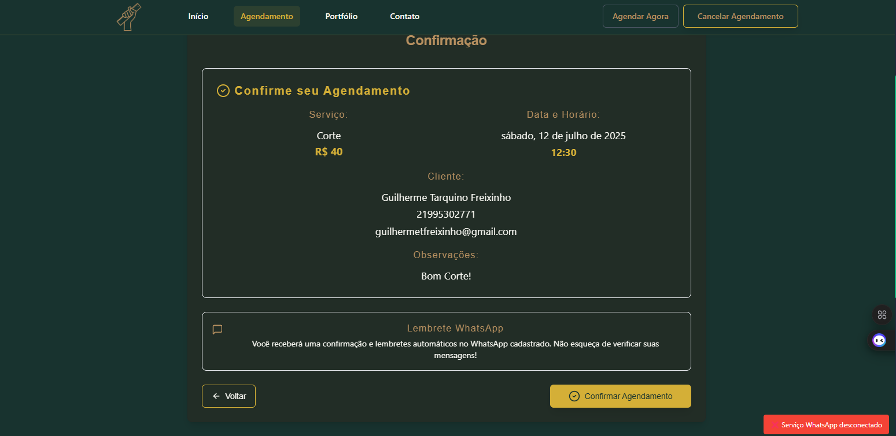
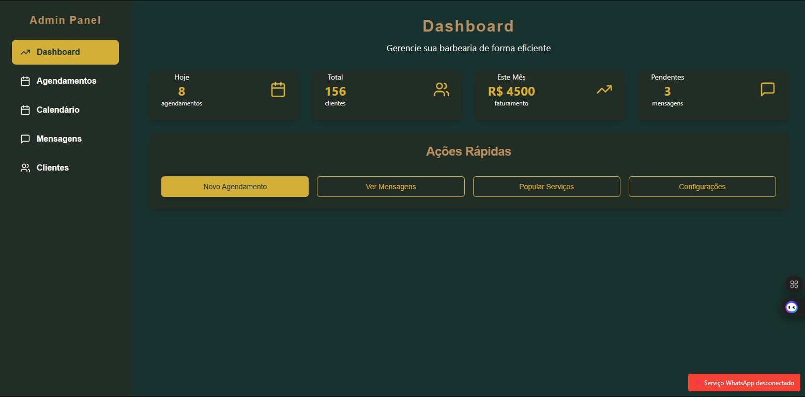

# 🪒 Club Régua Máxima - Barbershop Booking System

> Sistema de agendamento online para barbearia com integração WhatsApp (em desenvolvimento)

[](https://reactjs.org/)
[](https://fastapi.tiangolo.com/)
[](https://www.mongodb.com/)
[](https://nodejs.org/)

## 🚀 Sobre o Projeto

Sistema full-stack em desenvolvimento para automatizar o processo de agendamento de uma barbearia, incluindo notificações automáticas via WhatsApp e painel administrativo completo.

### ✨ Principais Funcionalidades

- 📅 **Agendamento Online** - Interface intuitiva para clientes
- 📱 **Integração WhatsApp** - Confirmações e lembretes automáticos  
- 👨‍💼 **Painel Admin** - Gestão completa de agendamentos e clientes
- 📊 **Dashboard** - Estatísticas e relatórios em tempo real
- 🎨 **Design Responsivo** - Otimizado para todos os dispositivos
- ⚡ **Performance** - Carregamento rápido e animações suaves

## 🛠️ Tecnologias

### Frontend
- **React.js** - Biblioteca para interfaces de usuário
- **Tailwind CSS** - Framework CSS utilitário
- **Framer Motion** - Biblioteca de animações
- **React Router** - Roteamento SPA
- **Axios** - Cliente HTTP

### Backend
- **FastAPI** - Framework web moderno para Python
- **MongoDB** - Banco de dados NoSQL
- **Pydantic** - Validação de dados
- **Motor** - Driver assíncrono para MongoDB

### Automação
- **Node.js** - Runtime JavaScript
- **Baileys** - Biblioteca WhatsApp Web
- **WebSocket** - Comunicação em tempo real

## 🚀 Como Executar

### Pré-requisitos
- Node.js 18+
- Python 3.9+
- MongoDB 7.0+

### Instalação

```bash
# Clone o repositório
git clone https://github.com/Freixin/club-regua-maxima.git
cd club-regua-maxima

# Instale as dependências
npm install

# Configure as variáveis de ambiente
cp .env.example .env

# Inicie todos os serviços
./iniciar.bat  # Windows
# ou
./iniciar.sh   # Linux/Mac
```

### Acesso
- **Frontend:** http://localhost:3000
- **API:** http://localhost:8000
- **Admin:** http://localhost:3000/admin

## 📱 Screenshots

### 🏠 Página Inicial
<div align="center">
  
  <p><em>Interface principal com hero section e informações da barbearia</em></p>
</div>

### 📅 Sistema de Agendamento
<div align="center">
  
  <p><em>Fluxo completo de agendamento com seleção de serviços</em></p>
</div>

### 👨‍💼 Painel Administrativo
<div align="center">
  
  <p><em>Dashboard com estatísticas e gestão de agendamentos</em></p>
</div>

### 📱 WhatsApp Integration
<div align="center">
  
  <p><em>Monitoramento do status da integração WhatsApp</em></p>
</div>

### 📱 Versão Mobile
<div align="center">
  
  
  <p><em>Interface responsiva otimizada para dispositivos móveis</em></p>
</div>

## 🏗️ Arquitetura

```
├── frontend/          # React.js application
├── backend/           # FastAPI application  
├── whatsapp-bot/      # Node.js WhatsApp integration
├── scripts/           # Automation scripts
└── docs/              # Documentation
```

## 🎯 Funcionalidades Detalhadas

### Para Clientes
- [x] Visualização de serviços disponíveis
- [x] Seleção de data e horário
- [x] Preenchimento de dados pessoais
- [ ] Confirmação via WhatsApp (em testes)
- [x] Cancelamento de agendamentos

### Para Administradores
- [x] Dashboard com métricas
- [x] Calendário de agendamentos
- [x] Gestão de clientes
- [ ] Configuração de serviços (em desenvolvimento)
- [ ] Relatórios e estatísticas (em desenvolvimento)

## 🤝 Contribuindo

1. Faça um fork do projeto
2. Crie uma branch para sua feature (`git checkout -b feature/AmazingFeature`)
3. Commit suas mudanças (`git commit -m 'Add some AmazingFeature'`)
4. Push para a branch (`git push origin feature/AmazingFeature`)
5. Abra um Pull Request

## 📝 Licença

Este projeto está sob a licença MIT. Veja o arquivo [LICENSE](LICENSE) para mais detalhes.

## 👨‍💻 Autor

**Guilherme Tarquino Freixinho**
- LinkedIn: [https://www.linkedin.com/in/guilherme-freixinho/]
- GitHub: [https://github.com/Freixin]
- Email: [guilhermetfreixinho@gmail.com]

---

⭐ Se este projeto te ajudou, considere dar uma estrela!